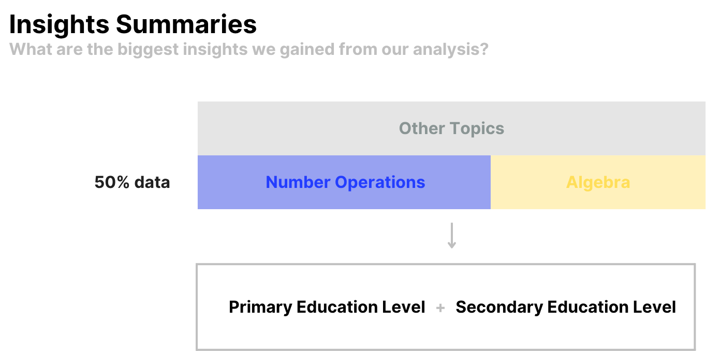
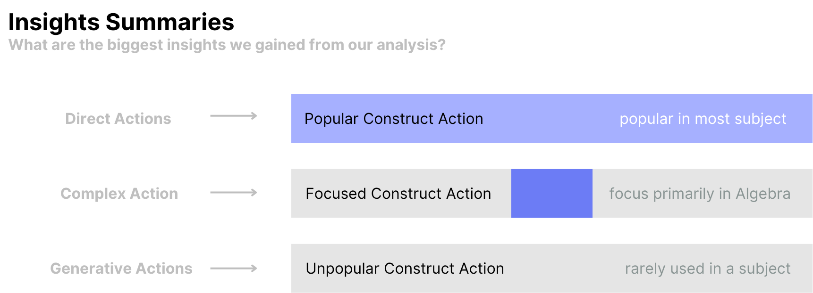
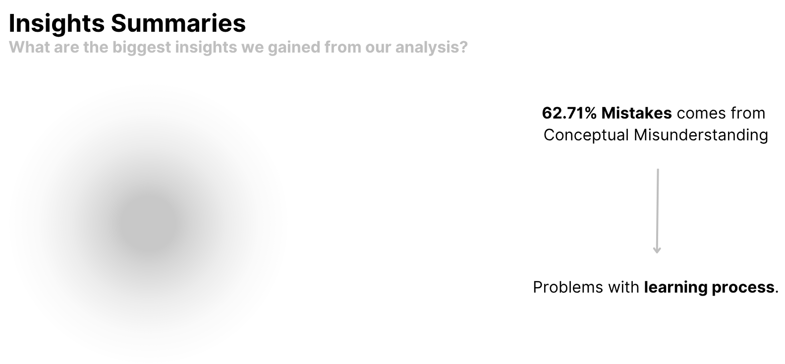
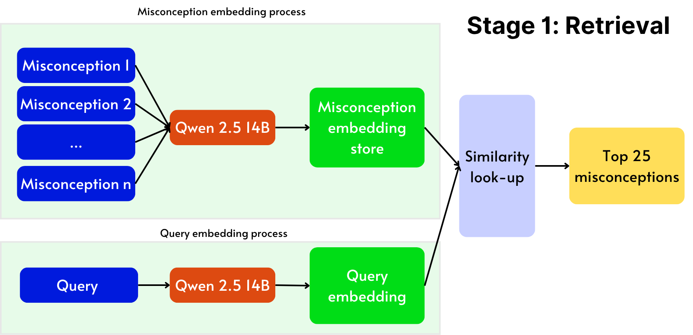
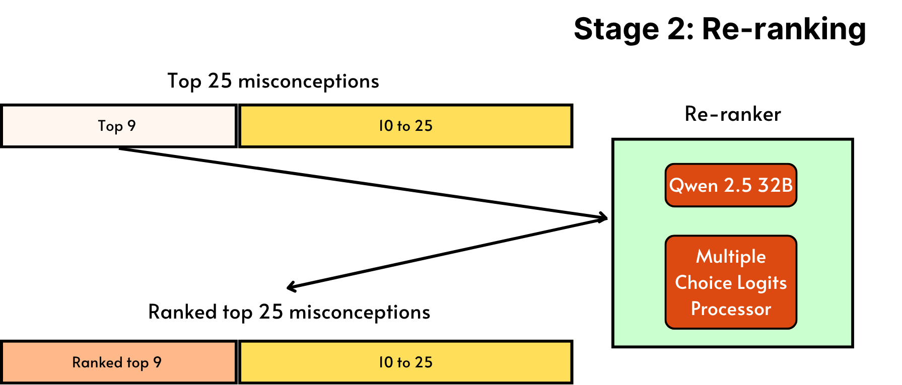

# Kaggle: Eedi - Mining Misconceptions in Mathematics  

This project explores the Kaggle competition “Eedi - Mining Misconceptions in Maths”, which focuses on predicting student misconceptions in mathematics using Natural Language Processing (NLP). The task involves analyzing multiple-choice diagnostic questions, where each incorrect option corresponds to a specific misconception. Our team approached the problem through both data exploration and model development, combining statistical analysis with machine learning techniques.

## About the competition 

### Background

Eedi is an educational platform where learners answer Diagnostic Questions.

- Each question has 4 answer options: 1 correct and 3 incorrect.
- Each incorrect answer corresponds to a specific misconception.

### Objective

The task is to build an NLP model capable of predicting misconceptions and incorrect answers in math multiple-choice questions.

## Methodology

Our approach consisted of two main parallel tasks:

**1. Data Exploration**

- Conducted exploratory data analysis (EDA)
- Applied statistical methods and data visualization
- Identified trends, patterns, and challenges in the dataset

**2. Model Development**
- Built and tested machine learning/NLP models for misconception prediction
- Submitted models to Kaggle for performance evaluation
- Drew inspiration from both team members’ experience and community approaches used in the competition

## Results 
### EDA 
Conducted statistical analysis on queries and semantic clustering using Claude API, which helps understand the structure of the data. For visualization, this is the conclusion of EDA after categorizing `constructs`, `questions` and `misconceptions`. 

  
  
  

### Model building 
Built 2 stage ML pipeline with Information Retrivial and Re-ranking. Specifically:
- Stage 1: Construct *question-answer* and corresponding *misconception* query using `Qwen 2.5 4B` language model and perform similarity look up to find top 25 matched misconceptions. 
- Stage 2: Perform re-ranking using `Qwen 2.5 32B` and select top 9 matched misconceptions.

  
  

Additional experiments with ensembles re-ranking pipelines are also performed with notible results.  

| | Public Score | Private Score | 
|--|--------------|--------------|
| Before ensemble | 0.49952 | 0.44615 | 
| After ensemble | 0.5298 | 0.48434 | 

(Score before competition end and final grade) 

Team's kaggle competition information can be found here: [Final Notebook](https://www.kaggle.com/code/caokhoihuynh/model-final?scriptVersionId=218454004)

## Team information 

| MSSV     | Full Name             | Task |
|----------|-----------------------|------|
| 21120036 | Nguyễn Hoài An        | Model training |
| 21120103 | Phan Thảo Nguyên      | Model training | 
| 21120179 | Nguyễn Đặng Đăng Khoa | Data analysis | 
| 21120275 | Huỳnh Cao Khôi        | Model training | 
| 21120308 | Phạm Lê Tú Nhi        | Data analyis | 

The project was completed under the guidance of Dr. Nguyễn Tiến Huy as part of the Deep Learning for Data Science course at the University of Science, VNU-HCM.
